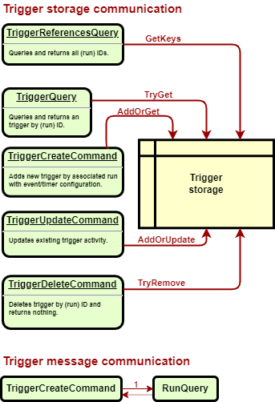

# assistant.net.scheduler.api

- [assistant.net.scheduler.api](#assistantnetschedulerapi)
  - [Introduction](#introduction)
  - [Operations](#operations)
    - [Automation](#automation)
    - [Job](#job)
    - [Run](#run)
    - [Trigger](#trigger)

## Introduction

Scheduler API hosted service implementation which reflects a slightly limited list of supported scheduler [operations](#operations).

## Operations

The application handles CRUD operations over `Automation`, `Job`, `Run` and `Trigger` resources.

### Automation

An execution flow definition of [jobs](#jobs) sequence.
e.g. Enabling the light on a room enter, or watering plants daily.

### Job

One element of [automation](#automation) describing what should happen as part of a bigger sequence. e.g.

- perform custom action
- wait for some event occurred (operation completed, a timer event, a sensor event)

### Run

A representation of started flow run due to [automation](#automation) definition. A dedicated run is created
per [automation job](#job) and linked to each other sequentially reflecting the original job order.

### Trigger

A counterpart of a waiting kind of job. A trigger is being created once associated job run is started and when
trigger expectations is matched, it completes the job run in response.

